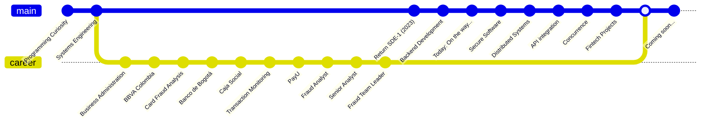

# My Story

My interest in software development began more than twenty years ago, when I first studied Systems Engineering and learned the fundamentals of programming with C++. Although I was unable to continue my studies at that time, my curiosity about software never disappeared.

My professional career eventually led me into the financial sector, where I spent several years working in banks and payment companies in roles focused on fraud prevention, transaction monitoring, and financial risk analysis.

Throughout that journey I had the opportunity to understand how the payment ecosystem works beyond the software itself.

I worked with processes involving payment cards, transaction monitoring, fraud detection, chargebacks, customer claims, payment gateways, acquiring, and the operational challenges faced by fraud analysts every day.

While working in these environments I often found myself imagining better tools.

I wondered how analysts could access the information they needed without compromising security, how transaction patterns could be analyzed more efficiently, how event-driven systems could automate repetitive investigations, and how software could reduce operational effort while improving fraud detection.

Those ideas became the motivation to return to software engineering.

In 2023 I decided to formally resume my path as a software engineer, and today I am completing my Software Engineering degree while building projects that combine modern software engineering practices with my experience in financial technology.

---

# Why Fintech?

Many software engineers learn finance after they become developers.

My journey happened in the opposite direction.

Before writing production software, I spent years understanding how financial institutions operate, how fraud teams investigate suspicious transactions, and how payment systems interact behind the scenes.

Because of that experience, my projects are inspired by real operational problems rather than hypothetical examples.

My goal is to build software that helps financial institutions become safer, more efficient, and more scalable.

---

# My Engineering Philosophy

I believe software should solve real problems.

For me, writing code is only one part of engineering.

Understanding the business domain, asking the right questions, making thoughtful architectural decisions, documenting the reasoning behind those decisions, and continuously learning are equally important.

This repository reflects that philosophy.

---

# Long-Term Vision

My long-term goal is to become a software engineer specialized in Financial Technology.

I want to design and build systems that improve payment platforms, fraud prevention, transaction monitoring, financial risk analysis, and secure distributed services.

Every note, project, experiment, and decision documented here is another step toward that goal.

---
