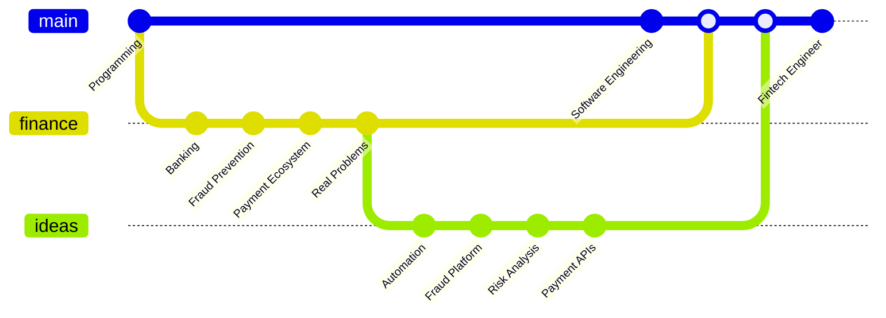

 

```rust
fn main(){
    let future = async {
        // ideas -> code -> impact
        build_something().await;       
    };
    run_concurrent(future);
}
```
# :link: [From Fraud to Software](https://github.com/JhalexR/JhalexR/blob/main/MyStory/from-fraud-to-software.md) :link:

 >> _I spent years understanding how financial fraud works. </br> Now, I'm building the software I once wished existed._



<p>
  <a href="https://www.linkedin.com/in/jhalexr/">
    
  </a>
</p>

I’m John Alexander, a Software Engineering student 🔰 from Colombia, focused on backend development for the fintech and banking sectors. 💳

I am currently in the early stages of my tech career 🌱 and am actively seeking opportunities to gain practical experience through internships or junior roles. 🎓

My passion for software development started years ago. Although my career path initially led me to the financial sector :moneybag: 

I never stopped learning programming on my own :footprints:

In 2023, I decided to fully commit to this path and began my formal studies in Software Engineering to turn my industry experience into powerful technical solutions. :gear:

</br>

>> _I know the problem because I lived it, and now I want to develop the tools to solve it._

</br>

**Thanks for visiting my profile!** 

</br>

---

### :hammer_and_wrench: Languages and Tools I am learning :

<div>

   
   
   
   
   
   
  

### :telescope: Tools I would like to add in the future :

  
   
   

</div>

---


<h2>
:fire: My Stats :
</h2>

<div>

 ### :trophy: Top
 
<p align="left">
 
   <a href="https://github.com/JhalexR"></a>  
</p>

### :stars: obtained
<p align="left">
 
<br>
    <a href="https://github.com/JhalexR"></a> 
</p>
</div>

<div>
 
### :watch: Streak 

[](https://git.io/streak-stats)

</div>

<div>
 
### :coin: Contributions

<p align="left">
  <a href="https://github.com/JhalexR">
    
  </a>
</p>
</div>

<div>

### :construction_worker_man: Workday


</div>
